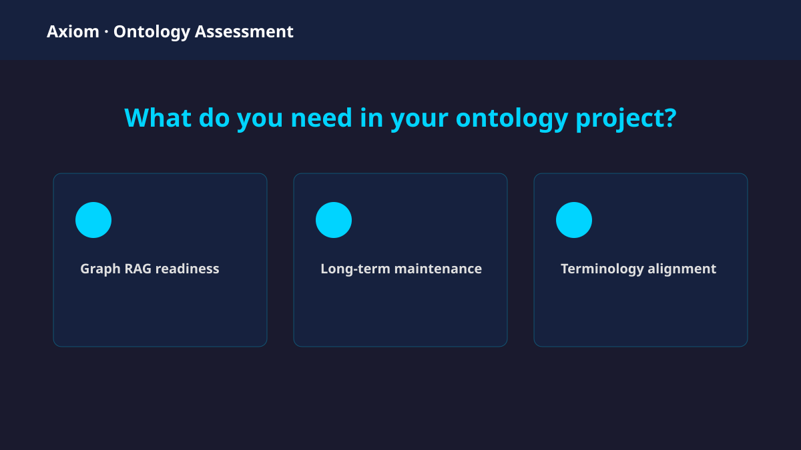

# Axiom Ontology Assessment

A static, privacy-first web application for an initial automated assessment of RDF/OWL ontologies and ontology-based knowledge graphs. It evaluates annotation coverage for Graph RAG, detects references to foundational ontologies, and compares ontology labels with terminology found in internal PDF/TXT documents.

> This tool provides an initial automated assessment. It is not a complete ontology-quality certification and does not replace domain-specific review, reasoning validation, competency-question testing, or tailored quality metrics.

## Screenshot



## Main characteristics

- Three-step accessible flow: Objectives → Files → Results.
- Entirely client-side processing. Files are neither uploaded nor persisted.
- Oxigraph WebAssembly store with SPARQL 1.1 queries.
- Turtle, RDF/XML, OWL, N-Triples, N-Quads, and TriG input.
- PDF text extraction through PDF.js and direct TXT reading.
- English/Portuguese stopword removal and accessible word cloud.
- Responsive B2B interface using Axiom Semantics' official navy/cyan visual language.
- Static Vite build and GitHub Pages workflow.

## Technology and browser requirements

React 19, TypeScript, Vite, Oxigraph (WebAssembly), PDF.js, Lucide, and Vitest. A current browser with WebAssembly reference types, `WeakRef`, Web Workers, ES modules, and modern Unicode regular-expression support is required. No Node.js API is used at runtime.

## Local development

Requires Node.js 22+ and npm.

```bash
npm install
npm run dev
```

Then open the local URL printed by Vite.

```bash
npm run lint
npm test
npm run build
npm run preview
```

The production output is generated in `dist/`.

## Architecture

```text
src/
  components/
    common/          stepper and file input
    visualizations/  gauge and word cloud
  config/            annotations, thresholds, contact, foundational patterns
  features/
    assessment/      orchestration and result contracts
    documents/       PDF extraction, normalization, stopwords, term matching
    ontology/        Oxigraph adapter, SPARQL queries, metrics, RDF types
  test/              unit tests and RDF fixture
  utils/             file limits and formatting
  App.tsx            flow and screen composition
  styles.css         responsive visual system
```

Oxigraph is hidden behind `features/ontology/parser.ts`. SPARQL lives in `queries.ts`; input text is never interpolated into queries. The application does not fetch `owl:imports`. PDF.js uses its packaged worker, resolved by Vite.

## Supported files and limits

| Input | Formats | Limit |
|---|---|---|
| Ontology | `.ttl`, `.rdf`, `.owl`, `.nt`, `.nq`, `.trig` | 25 MB, one file |
| Documents | `.pdf`, `.txt` | 15 MB each, eight files |

Format detection considers content signatures as well as the extension. `.owl` may contain Turtle or RDF/XML. Empty/malformed RDF and PDFs without a text layer produce user-facing errors. Scanned PDFs require OCR and are not supported.

## Metric definitions

### Graph RAG annotations

- **Class label coverage** = classes with `rdfs:label`, `skos:prefLabel`, `skos:altLabel`, `dcterms:title`, or `schema:name` / all explicitly declared `owl:Class` or `rdfs:Class`.
- **Class description coverage** = classes with `rdfs:comment`, `skos:definition`, `dcterms:description`, or `IAO:0000115` / all detected classes.
- **Named entity label coverage** = named resources with a configured label / all named subject or object resources after excluding RDF, RDFS, OWL, and XSD structural IRIs.

Blank nodes are excluded from named entities. This operational definition intentionally avoids the ambiguous phrase “labels + classes / named entities.” Percentages are rounded to whole numbers. Zero denominators return 0%, not `NaN`.

Thresholds are Low (0–39%), Moderate (40–69%), Good (70–89%), and Excellent (90–100%). Change them in `src/config/thresholds.ts`.

### Foundational ontology references

All subject, predicate, and object IRIs are checked against configurable patterns for gUFO, DOLCE, BFO, YAMATO, and SUMO. Counts are approximate IRI occurrences, not a claim of semantic conformance. Add or change patterns in `src/config/foundationalOntologies.ts`.

### Terminology alignment

Document text is Unicode-normalized, lowercased, stripped of URLs and punctuation, tokenized, filtered for isolated numbers/short tokens, and stripped of the union of English and Portuguese stopwords. The same pipeline is applied to ontology labels.

- **Distinct term alignment** = distinct terms in the final top-50 word-cloud set found as exact normalized tokens in ontology labels / all distinct word-cloud terms.
- **Frequency-weighted match** = frequency sum of matched terms / frequency sum of all relevant terms.

Matching is lexical and exact after normalization. It does not perform stemming, lemmatization, fuzzy matching, synonym expansion, embeddings, or semantic inference. Add stopwords in `src/features/documents/stopwords.ts`; future language lists can be exported as additional sets.

## Privacy and security

Files are read with browser APIs and held only in component memory for the current page session. The application has no upload endpoint, analytics, `localStorage`, remote import resolver, or automatic form submission. PDF JavaScript evaluation is disabled. Contact actions assemble a `mailto:` URL only after a user click; the reply address is included in a structured draft and the user's email client shows the complete message before anything is sent.

## Contact configuration

Change the obfuscated email code points and website in:

```ts
// src/config/contact.ts
const CONTACT_EMAIL_CODE_POINTS = [/* decimal Unicode code points */];
export const AXIOM_WEBSITE = "https://axiomsemantics.com.br";
```

The address is not present as readable text or as a `mailto:` link in the initial
HTML. This discourages basic address-harvesting bots, but cannot defeat a crawler
that executes and analyzes the client-side JavaScript.

## GitHub Pages deployment

1. Push the repository to GitHub with `main` as the default branch.
2. Open **Settings → Pages** and choose **GitHub Actions** as the source.
3. Push to `main`, or run **Deploy to GitHub Pages** manually under Actions.
4. The workflow installs, lints, tests, builds, uploads `dist`, and deploys it.

During GitHub Actions, Vite derives `/<repository-name>/` from `GITHUB_REPOSITORY`, so assets, the PDF worker, and Oxigraph WASM work under `https://username.github.io/repository-name/`. Local development uses `/`. For a user-site repository named `username.github.io`, change `base` in `vite.config.ts` to `"/"`.

## Known limitations and next steps

- Very large graphs can consume substantial browser memory; the current upload cap reduces that risk.
- Oxigraph parsing currently runs on the main thread. Its WASM implementation is fast, but unusually complex files may briefly affect UI responsiveness.
- RDF inference is not enabled, so implicit classes are not exhaustively discovered.
- Remote imports are reported only as IRIs and never resolved.
- PDF extraction requires an existing text layer; no OCR is bundled.
- Word-cloud placement uses a responsive, non-overlapping weighted flex layout rather than a geometric spiral.
- Useful future extensions include a dedicated parsing worker, SHACL validation, ontology reasoning, competency questions, i18n, stemming/lemmatization, semantic matching, and project-specific KPIs.
